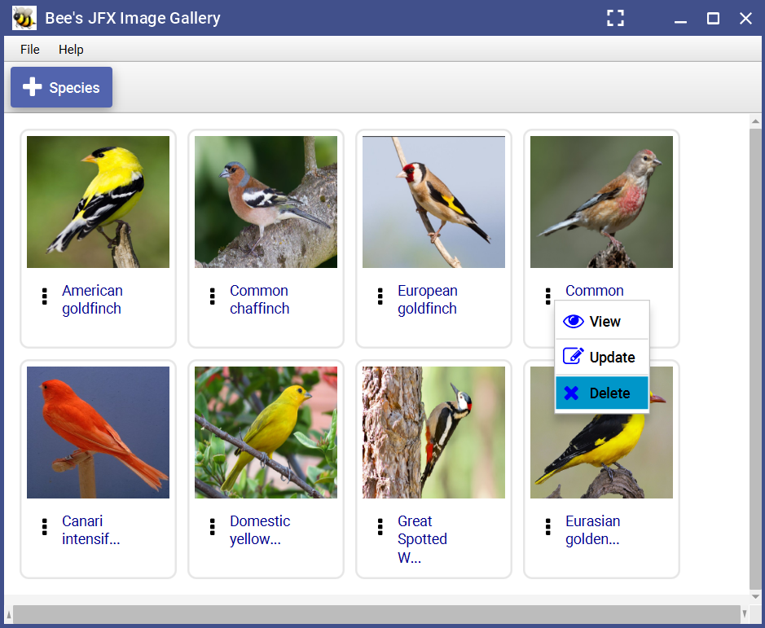

# Bee's JFX Image Gallery
Bee's JFX is a simple application for managing images of species written in Java and JavaFX framework. The managed images are stored in an SQLite database as BLOBs. 

## Main Features
- Add/update/remove an image.
- Listing of stored images.
- Image visualizer.

## Screenshots
  ​
  ​

## Libraries Used & Credits
- [SQLite JDBC Driver](https://github.com/xerial/sqlite-jdbc), (by xerial, Taro L. Saito).
- [FontAwesomeFX](https://mvnrepository.com/artifact/de.jensd/fontawesomefx) (by Dave Gandy).
- [JFoenix](https://github.com/sshahine/JFoenix). A javafx material design library (by Shadi Shaheen
).
- [JavaFX] (https://openjfx.io/)

